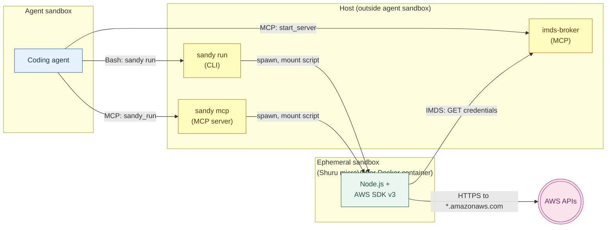

# Sandy

**Sandy runs TypeScript AWS queries inside a disposable sandbox, giving AI coding agents full SDK access and cross-account aggregation with no host credentials exposed.**

Sandy is for AI coding agents — Claude Code and peers — running against multi-account AWS estates, and the humans who drive them. Agents describe an investigation in natural language. Sandy executes the generated TypeScript in a fresh microVM or container. The script uses the full AWS SDK to gather and collate results, then returns only what the agent needs. The sandbox and IMDS flow exist because agents should not hold host-level credentials or reach AWS directly.



## How to use it

- **As an MCP server** — `sandy mcp`, registered automatically by the Claude Code plugin. Exposes the `sandy_image`, `sandy_check`, `sandy_run`, `sandy_resume_session`, and `prime` tools, plus embedded `sandy://skills/mcp/...` resources for script-authoring guidance.
- **As a CLI** — `sandy run --script path/to/script.ts --imds-port <port>`. Same backends, same guarantees. Suited to scripted workflows and agents that prefer driving binaries through a shell rather than MCP.

Both modes select from the same `Backend` implementation and share every runtime constraint.

## Why

Two workarounds dominate AI-agent access to AWS today, and both have sharp edges.

- **Published AWS MCP servers** expose a per-API-call surface against a single account. The agent issues many calls and collates the results itself, burning tokens on glue work. Sandy runs the aggregation inside the sandbox with the full AWS SDK v3, returns only what the agent asked for, and reaches any account available through `imds-broker`.
- **Unrestricted shell plus the `aws` CLI** is fast but gives the agent host-level access and visibility into static credentials. Sandy keeps the agent inside its own sandbox, routes credentials through IMDS into the microVM, and blocks child processes inside the VM via Node's permission model.

## Installation

<details>
<summary><strong>Homebrew (macOS)</strong></summary>

```sh
brew install jamestelfer/tap/sandy
```

</details>

<details>
<summary><strong>mise</strong></summary>

[mise](https://mise.jdx.dev/) installs directly from GitHub Releases via the [github backend](https://mise.jdx.dev/dev-tools/backends/github.html):

```sh
mise use -g github:jamestelfer/sandy
```

</details>

<details>
<summary><strong>npm</strong></summary>

```sh
npm install -g @jamestelfer/sandy
```

</details>

<details>
<summary><strong>Nix</strong></summary>

Install directly from the flake into your profile:

```sh
nix profile install github:jamestelfer/sandy
```

</details>

<details>
<summary><strong>Manual download</strong></summary>

Pre-built binaries for Linux and macOS (amd64/arm64) are on the [releases page](https://github.com/jamestelfer/sandy/releases). Download the archive for your OS and architecture, extract, and place the binary on your `PATH`.

</details>

<details>
<summary><strong>Build from source</strong></summary>

Requires Bun 1.3 or newer.

```sh
git clone https://github.com/jamestelfer/sandy
cd sandy
bun install
bun run build
./dist/sandy --help
```

</details>

### Claude Code plugin

The Claude Code plugin configures an agent to use Sandy as an MCP server and ships the agent-facing skill documentation. It does not install the binary — install via one of the methods above first.

```
/plugin install sandy
```

### Prerequisites

- [Shuru](https://github.com/nicholasgasior/shuru) or Docker — select with `sandy config` (defaults to Shuru)
- [imds-broker](https://github.com/jamestelfer/imds-broker) — serves AWS credentials via IMDS on the host
- Claude Code (optional, required only for the plugin)

Create the sandbox image once, then verify the environment:

```bash
sandy image create
sandy check baseline                        # no AWS credentials needed
sandy check connect --imds-port <port>      # verifies AWS connectivity
```

## Usage

### Via MCP

The Claude Code plugin launches `sandy mcp` and exposes four tools plus one resource. Start an IMDS server from the agent (through the `imds-broker` MCP), then call `sandy_run` with the port and the script:

```
sandy_image(action: "create")
sandy_check(action: "baseline")
sandy_run(script: "…", imdsPort: 9001, region: "us-west-2")
```

Progress streams via `notifications/progress`. Session state persists for the lifetime of the MCP process and resumes with `sandy_resume_session`.

Read `sandy://skills/mcp/resources/scripting-guide.md` from the MCP server for the full scripting contract.

### Via CLI

```bash
sandy run \
  --imds-port <port> \
  --script path/to/script.ts \
  --session <id> \
  -- [script args...]
```

| Flag | Required | Description |
|------|----------|-------------|
| `--imds-port <port>` | Yes | Port of the `imds-broker` IMDS server on the host |
| `--script <path>` | Yes | Path to the TypeScript file to execute |
| `--region <region>` | No | AWS region (default `us-west-2`) |
| `--session <id>` | No | Session identifier; groups output under `.sandy/<id>/` |
| `--output-dir <dir>` | No | Override the host output directory |
| `-- [args...]` | No | Arguments forwarded to the script via `process.argv` |

Script output written to `/workspace/output` inside the sandbox syncs back to `.sandy/<session>/` on the host.

### Writing scripts

Scripts are TypeScript with access to every `@aws-sdk/client-*` package, plus `arquero`, `simple-ascii-chart`, `console-table-printer`, `@fast-csv/format`, and `jmespath`. Two patterns are mandatory.

- **Use `async function*` generators for paginated AWS calls.** Progress appears immediately, partial results survive failures, and callers decide when to stop.
- **Call the SDK directly.** No `child_process`. No shelling out to `aws`.

```typescript
import { ECSClient, ListServicesCommand } from "@aws-sdk/client-ecs"

const ecs = new ECSClient({ region: process.env.AWS_REGION })

async function* listServiceArns(cluster: string): AsyncGenerator<string[]> {
  let nextToken: string | undefined
  do {
    const resp = await ecs.send(new ListServicesCommand({ cluster, nextToken }))
    const arns = resp.serviceArns ?? []
    if (arns.length > 0) yield arns
    nextToken = resp.nextToken
  } while (nextToken)
}

for await (const batch of listServiceArns("my-cluster")) {
  console.log(`Got ${batch.length} services`)
}
```

Full guide: `sandy://skills/mcp/resources/scripting-guide.md` via MCP, or `sandy resource sandy://skills/cli/resources/scripting-guide.md` via CLI.

## How it works

Sandy compiles to a single Bun binary with the bootstrap filesystem, scripting guide, and example scripts embedded at build time. The binary hosts both the CLI and the MCP server. Both dispatch through the same `Backend` abstraction (`imageCreate`, `imageDelete`, `imageExists`, `run`).

On `sandy run`, the active backend stages the bootstrap directory, mounts the script directory read-only into the sandbox, runs `tsc` for type-checking, then invokes `node --permission` on the compiled JavaScript. The AWS SDK resolves credentials from `http://10.0.0.1:<imds-port>` — served by `imds-broker` on the host — so no credential ever touches VM disk. Subprocess stdout and stderr stream through one `OutputHandler` to host stderr; lines prefixed `[-->` are stripped and forwarded as progress (bold text for the CLI, `notifications/progress` for MCP). The sandbox is discarded on exit.

Backends are modality-agnostic. Swapping Shuru for Docker changes where the process runs and which egress policy applies. The progress protocol, mount layout, and bootstrap contract stay identical.

## Caveats

- **Shuru runs on macOS and arm64 Linux only.** Use the Docker backend on x86_64 Linux or in CI.
- **Docker does not enforce domain-based egress filtering.** The Shuru backend restricts egress to `*.amazonaws.com` and `*.aws.amazon.com`; Docker does not. Prefer Shuru for scripts from untrusted sources.
- **Credentials depend on `imds-broker`.** Sandy does not issue or cache credentials. The broker must be reachable on the IMDS port you pass in.
- **One MCP session at a time.** The MCP server holds a single active session in memory. Resume with `sandy_resume_session`; parallel sessions are not supported.
- **No persistent state between runs.** Each run starts from a clean sandbox image. Recreate the image after editing `embedded/bootstrap/` files.
- **Skill source of truth.** `embedded/skills/mcp/SKILL.md` is canonical for MCP skill content. `plugin/skills/sandy/SKILL.md` must stay synchronised; a test enforces equality.

## Acknowledgements

- [Shuru](https://github.com/nicholasgasior/shuru) — ephemeral microVM runtime
- [Bun](https://bun.com) — runtime, test runner, and single-binary compiler
- [Model Context Protocol SDK](https://github.com/modelcontextprotocol/typescript-sdk)
- [Claude Code](https://claude.ai/code) — the primary agent Sandy was designed with

## License

Apache 2.0 — see [LICENSE](LICENSE).
